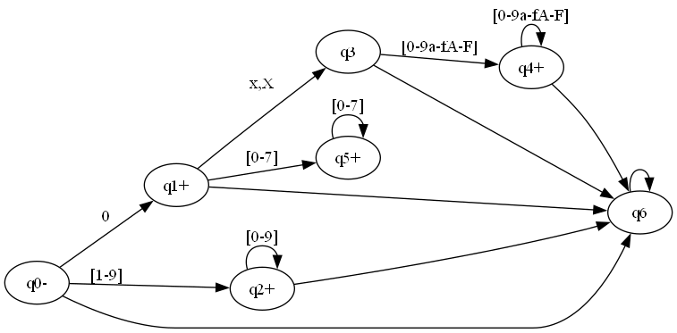

# tpgrupal2
Tp2 de la materia sintaxis y semántica de los lenguajes
### 🧮 Tabla de transiciones del AFD

| Estado | `0`   | `[1–9]` | `[0–9]` | `[0–7]` | `[0–9a–fA–F]` |
|--------|-------|---------|---------|---------|---------------|
| `q0-`  | `q1+` | `q2+`   | `q6`    | `q6`    | `q6`          |
| `q1+`  | `q6`  | `q6`    | `q6`    | `q5+`   | `q6`          |
| `q2+`  | `q2+` | `q2+`   | `q2+`   | `q2+`   | `q6`          |
| `q3`   | `q6`  | `q6`    | `q6`    | `q6`    | `q4+`         |
| `q4+`  | `q4+` | `q4+`   | `q4+`   | `q4+`   | `q4+`         |
| `q5+`  | `q5+` | `q6`    | `q6`    | `q5+`   | `q6`          |
| `q6`   | `q6`  | `q6`    | `q6`    | `q6`    | `q6`          |

